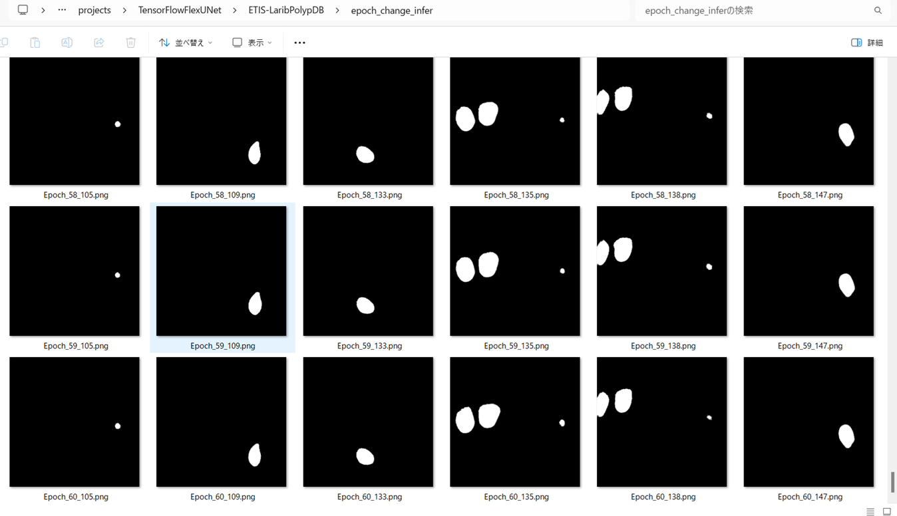

<h2>TensorFlow-FlexUNet-Image-Segmentation-ETIS-LaribPolypDB (2025/06/18)</h2>

This is the second experiment of Image Segmentation for ETIS-LaribPolypDB 
 based on our TensorFlowFlexUNet (TensorFlow Flexible UNet Image Segmentation Model for Multiclass) 
and, <a href="https://drive.google.com/file/d/1uXhQ2lhfZwSasSmo3jdMRvWckHDz0U2G/view?usp=sharing">
Augmented-ETIS-PNG-LaribPolypDB-ImageMask-Dataset.zip</a>, 
which was derived by us from 
<a href="https://www.kaggle.com/datasets/nguyenvoquocduong/etis-laribpolypdb"><b>ETIS-LaribPolypDB</b></a> on Kaggle website.
 
 
Our Multiclass TensorFlowFlexUNet, which uses categorized masks, can also be applied to 
single-class image segmentation models. 
This is because it inherently treats the background as one category and your single-class mask data as 
a second category. In essence, your single-class segmentation model will operate with two categorized classes within our Multiclass UNet framework.
 
 

<b>Actual Image Segmentation for Images of 512x512 pixels</b> 
As shown below, the inferred masks look similar to the ground truth masks.  

<table>
<tr>
<th>Input: image</th>
<th>Mask (ground_truth)</th>
<th>Prediction: inferred_mask</th>
</tr>
<tr>
<td></td>
<td></td>
<td></td>
</tr>

<tr>
<td></td>
<td></td>
<td></td>
</tr>

<tr>
<td></td>
<td></td>
<td></td>
</tr>
</table>

 

<h3>1. Dataset Citation</h3>
The dataset used here has been taken from the following kaggle web-site: 
<a href="https://www.kaggle.com/datasets/nguyenvoquocduong/etis-laribpolypdb"><b>ETIS-LaribPolypDB</b></a>.
 
 
<b>License</b>: Unknown
 
<h3>
<a id="2">
2 ETIS-LaribPolypDB ImageMask Dataset
</a>
</h3>
 If you would like to train this ETIS-LaribPolypDB Segmentation model by yourself,
 please download the dataset from the google drive  
<a href="https://drive.google.com/file/d/1uXhQ2lhfZwSasSmo3jdMRvWckHDz0U2G/view?usp=sharing">
Augmented-ETIS-PNG-LaribPolypDB-ImageMask-Dataset.zip</a>
, expand the downloaded ImageMaskDataset and put it under <b>./dataset</b> folder to be
<pre>
./dataset
└─ETIS-LaribPolypDB
    ├─test
    │   ├─images
    │   └─masks
    ├─train
    │   ├─images
    │   └─masks
    └─valid
        ├─images
        └─masks
</pre>
 
 
<b>ETIS-LaribPolypDB Statistics</b> 
 
 
As shown above, the number of images of train and valid datasets is enough to use for a training set of our segmentation model.

 
 
<b>Train_images_sample</b> 

 
<b>Train_masks_sample</b> 

 

<h3>
3 Train TensorflowUNet Model
</h3>
 We have trained ETIS-LaribPolypDBTensorflowUNet Model by using the following
<a href="./projects/TensorFlowFlexUNet/ETIS-LaribPolypDB/train_eval_infer.config"> <b>train_eval_infer.config</b></a> file.  
Please move to ./projects/TensorFlowFlexUNet/ETIS-LaribPolypDBand run the following bat file. 
<pre>
>1.train.bat
</pre>
, which simply runs the following command. 
<pre>
>python ../../../src/TensorflowFlexUNetTrainer.py ./train_eval_infer.config
</pre>

<b>Model parameters</b> 
Defined a small <b>base_filters</b> and large <b>base_kernels</b> for the first Conv Layer of Encoder Block of 
<a href="./src/TensorflowFlexUNet.py">TensorflowFlesUNet.py</a> 
and a large num_layers (including a bridge between Encoder and Decoder Blocks).
<pre>
[model]
base_filters   = 16
base_kernels   = (9,9)
num_layers     = 8
num_classes    = 2

dilation       = (3,3)
</pre>

<b>Learning rate</b> 
Defined a very small learning rate.  
<pre>
[model]
learning_rate  = 0.00001
</pre>

<b>Online augmentation</b> 
Disabled our online augmentation.You may train this model by setting this generator parameter to True. 
<pre>
[model]
model         = "TensorflowUNet"
generator     = False
</pre>

<b>Loss and metrics functions</b> 
Specified "categorical_crossentropy" and <a href="./src/dice_coef_multiclass.py">"dice_coef_multiclass"</a>. 
<pre>
[model]
loss           = "categorical_crossentropy"
metrics        = ["dice_coef_multiclass"]
</pre>
<b>Learning rate reducer callback</b> 
Enabled learing_rate_reducer callback, and a small reducer_patience.
<pre> 
[train]
learning_rate_reducer = True
reducer_factor     = 0.4
reducer_patience   = 4
</pre>

<b>Early stopping callback</b> 
Enabled early stopping callback with patience parameter.
<pre>
[train]
patience      = 10
</pre>
<b>Mask RGB_map</b> 
[mask]
<pre>
mask_datatype    = "categorized"
mask_file_format = ".png"
;ETIS-LaribPolypDB rgb color map dict for 1+1 classes.
;    Background:black, Polyp:white
rgb_map = {(0,0,0):0,(255, 255, 255):1, }
</pre>
<b>Epoch change inference callbacks</b> 
Enabled epoch_change_infer callback. 
<pre>
[train]
epoch_change_infer       = True
epoch_change_infer_dir   =  "./epoch_change_infer"
epoch_changeinfer        = False
epoch_changeinfer_dir    = "./epoch_changeinfer"
num_infer_images         = 6
</pre>

By using this callback, on every epoch_change, the inference procedure can be called
 for 6 images in <b>mini_test</b> folder. This will help you confirm how the predicted mask changes 
 at each epoch during your training process.    

<b>Epoch_change_inference output at starting (epoch 1,2,3)</b> 
 
 

<b>Epoch_change_inference output at middlepoint (epoch 28,29,30)</b> 
 
 
<b>Epoch_change_inference output at ending (epoch 58,59,60)</b> 
 
 

In this experiment, the training process was stopped at epoch 60 by EarlyStopping callback.  
 
 

<a href="./projects/TensorFlowFlexUNet/ETIS-LaribPolypDB/eval/train_metrics.csv">train_metrics.csv</a> 
 

 
<a href="./projects/TensorFlowFlexUNet/ETIS-LaribPolypDB/eval/train_losses.csv">train_losses.csv</a> 
 

 

<h3>
4 Evaluation
</h3>
Please move to a <b>./projects/TensorFlowFlexUNet/ETIS-LaribPolypDB</b> folder, 
and run the following bat file to evaluate TensorflowUNet model for ETIS-LaribPolypDB. 
<pre>
./2.evaluate.bat
</pre>
This bat file simply runs the following command.
<pre>
python ../../../src/TensorflowFlexUNetEvaluator.py ./train_eval_infer_aug.config
</pre>

Evaluation console output: 

  Image-Segmentation-ETIS-LaribPolypDB

<a href="./projects/TensorFlowFlexUNet/ETIS-LaribPolypDB/evaluation.csv">evaluation.csv</a> 

The loss (bce_dice_loss) to this ETIS-LaribPolypDB/test was very low, and dice_coef very high as shown below.
 
<pre>
categorical_crossentropy,0.017
dice_coef_multiclass,0.9933
</pre>
 

<h3>
5 Inference
</h3>
Please move to a <b>./projects/TensorFlowFlexUNet/ETIS-LaribPolypDB</b> folder 
,and run the following bat file to infer segmentation regions for images by the Trained-TensorflowUNet model for ETIS-LaribPolypDB. 
<pre>
./3.infer.bat
</pre>
This simply runs the following command.
<pre>
python ../../../src/TensorflowFlexUNetInferencer.py ./train_eval_infer_aug.config
</pre>

<b>mini_test_images</b> 
 
<b>mini_test_mask(ground_truth)</b> 
 

<b>Inferred test masks</b> 
 
 

<b>Enlarged images and masks </b> 

<table>
<tr>
<th>Image</th>b
<th>Mask (ground_truth)</th>
<th>Inferred-mask</th>
</tr>

<tr>
<td></td>
<td></td>
<td></td>
</tr>

<tr>
<td></td>
<td></td>
<td></td>
</tr>

<tr>
<td></td>
<td></td>
<td></td>
</tr>
<tr>
<td></td>
<td></td>
<td></td>
</tr>
<tr>
<td></td>
<td></td>
<td></td>
</tr>
<tr>
<td></td>
<td></td>
<td></td>
</tr>
</table>

 

<h3>
References
</h3>

<b>1. Automated Detection of Colorectal Polyp Utilizing Deep Learning Methods With Explainable AI</b> 
Faysal Ahamed, Rabiul Islam, Nahiduzzaman, Jawadul Karim, Mohamed Arselene Ayari, Amith Khandakar 

<a href="https://ieeexplore.ieee.org/document/10534764">https://ieeexplore.ieee.org/document/10534764</a> 
 
 
<b>2. Tensorflow-Image-Segmentation-Pre-Augmented-ETIS-LaribPolypDB</b> 
Toshiyuki Arai @antillia.com 
<a href="https://github.com/sarah-antillia/Tensorflow-Image-Segmentation-Pre-Augmented-ETIS-LaribPolypDB">
https://github.com/sarah-antillia/Tensorflow-Image-Segmentation-Pre-Augmented-ETIS-LaribPolypDB
</a>
 

